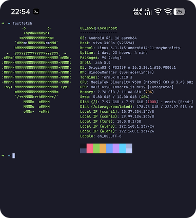
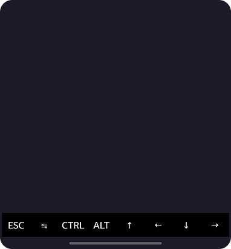

# FancyTermux

Make your Termux look decent. One script to set up everything: themes, fonts, and colors. No manual config needed.

New font, background color, buttons and auto opening fastfetch





### Quick start
Paste this into your terminal:
```bash
curl -sL https://githubusercontent.com -o setup.sh && chmod +x setup.sh && ./setup.sh
```

